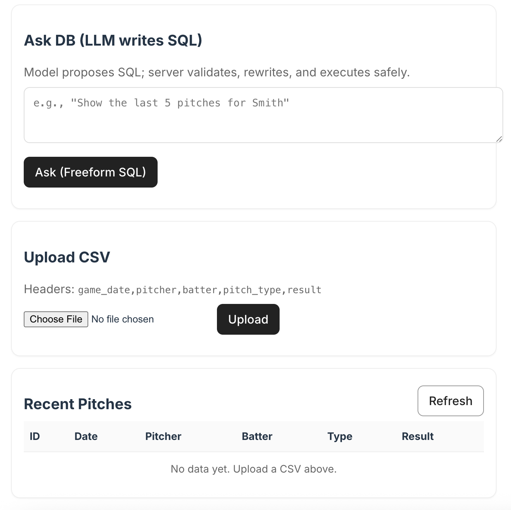

# ⚾🤖 Sofbot

Full-stack app for uploading softball pitch data and asking questions via **LLM → SQL**.

**Tech stack:**  
**React (Vite + TypeScript)** • **FastAPI** • **Postgres (Docker)** • **OpenAI-compatible LLM** (e.g. LLaMA 3-8B via [Ollama](https://ollama.com/)).

---

## 📂 Repository Layout

| Path                | Description |
|---------------------|------------|
| **backend/**        | FastAPI app, SQL validator, safe SQL templates |
| **frontend/**       | React app (Vite + TypeScript) |
| **models/**         | Local model weights/configs for Ollama |
| **docker-compose.yml** | Docker Compose configuration |
| **README.md**       | Project documentation |


---

## ⚙️ Prerequisites

- [Docker Desktop](https://www.docker.com/products/docker-desktop) (or Docker + Compose)
- [Node.js](https://nodejs.org/) **≥ 18** (for local frontend development)
- Local LLM server: [Ollama](https://ollama.com/) with **OpenAI-compatible `/v1`** endpoint

---

## 🚀 Quickstart

```bash
docker compose up --build
```

Open:
- Frontend: http://localhost:5173
- API: http://localhost:8000/health

---

## 💻 Interface Overview

<p align="center">
  
</p>


---

## 🛠 Environment Variables (API)

Set in docker-compose.yml → services.api.environment:

- DATABASE_URL (defaults to Compose Postgres)
- LLM_BASE_URL (e.g. http://host.docker.internal:11434/v1 for Ollama)
- LLM_MODEL_NAME
- LLM_API_KEY (if required)
- LLM_RATE_MAX (default 30)
- LLM_RATE_WINDOW_SEC (default 3600)

---

## 📄 CSV Upload Format

Headers must be exact:

game_date,pitcher,batter,pitch_type,result

Upload via UI or:

curl -X POST http://localhost:8000/pitches/upload-csv \
  -F "file=@sample.csv"

---

## 🔑 Key API Endpoints

GET /health

POST /pitches/upload-csv (size/row-capped, bulk insert)

POST /sql/freeform/ask (LLM writes SQL → validator → execute; rate-limited)

---

## Example: Ask a Question

curl -sS -X POST http://localhost:8000/sql/freeform/ask \
  -H "Content-Type: application/json" \
  -d '{"question":"Count pitches by pitch_type for Smith, most to least"}' | jq

---

## 🩹 Troubleshooting

CORS: ensure backend allows http://localhost:5173

429: you hit LLM rate limit; tune env

Upload 400: check headers / size / row caps

Freeform 400: validator blocked joins/subqueries/unsupported functions
